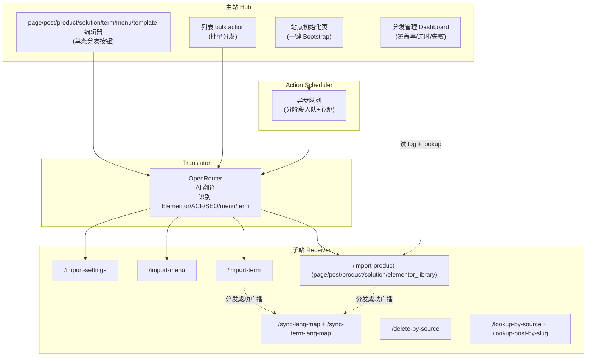
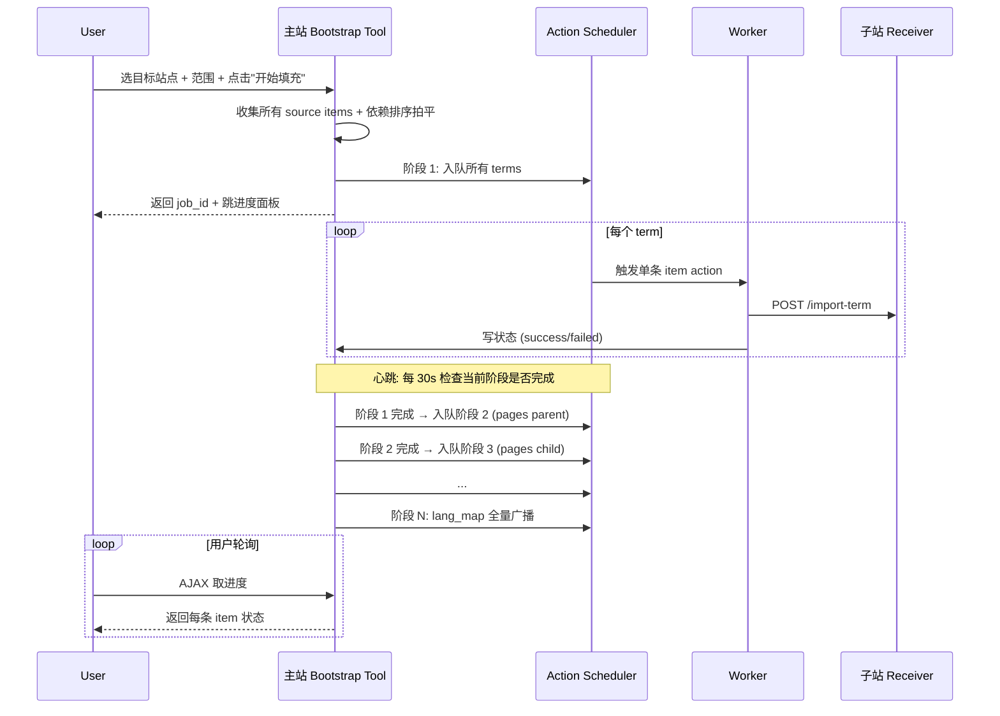

# HEB Product Publisher v3.0 — 一键开站（Site Bootstrap）

> 状态：方案已确认（2026-05-18），等待开干
> 入口 PR：PR 0
> 总工期：16–22 天

---

## 0. 目标一句话

> 子站只要做 3 步：装 WP、装本插件、配 secret。主站点一次「开始填充」→ 30 分钟后空站变成主站的本地化全克隆，含内容/分类/菜单/设置/Elementor 全站模板/hreflang 矩阵。后续主站任何改动一键回流到所有子站。

---

## 1. 用户视角的两个核心流程

### 1.1 开新站（一次性）

子站手工：

1. 装 WP（域名 + 数据库 + wp-config）
2. 装插件：Elementor（+ Pro 如用）、ACF、Yoast、heb-product-publisher
3. 装主题：hello-elementor-child
4. WP 设置 → 常规 → 站点语言 = 目标语言（如 `ja_JP`）
5. heb-product-publisher 设置页 → 填 `receiver_secret`、选角色 = Receiver

主站手工（每个新子站约 1 分钟）：

1. HEB Publisher → 远端站点列表 → 添加该子站
2. HEB Publisher → 站点初始化 → 选该站点 → 开始填充

之后挂机 30 分钟。

### 1.2 日常增量（持续）

- 主站编辑 page/post/product/term/menu/Elementor 模板 → 点「翻译并分发」按钮 → 所有子站自动更新
- 或者打开 Dashboard 看「过时 N 条」→ 批量重发
- 或者开启「保存即分发」toggle，主站保存自动分发到所有子站

---

## 2. 总体架构



---

## 3. PR 拆分（共 6 个 PR）

### PR 0 — 站点角色切换（0.5–1 天）

引入 `heb_pp_site_role` option 显式声明本站是 Hub / Receiver / Auto，避免分站被误配成 Hub 反向分发污染主站。

**改动**：

- [`heb-product-publisher/includes/class-admin-settings.php`](../includes/class-admin-settings.php) 顶部加 radio
- [`heb-product-publisher/includes/bootstrap.php`](../includes/bootstrap.php) 按 role 决定实例化哪些 class
- [`heb-product-publisher/includes/class-hub-ui.php`](../includes/class-hub-ui.php) 仅 Hub 注册 metabox
- [`heb-product-publisher/includes/class-receiver.php`](../includes/class-receiver.php) 仅 Receiver 注册 REST 路由
- [`heb-product-publisher/includes/class-bulk.php`](../includes/class-bulk.php) 仅 Hub 注册 bulk action

**三态规则**：

| 角色 | 显示 | 隐藏 |
|---|---|---|
| Hub | 远端列表 + OpenRouter key + 分发 metabox + 批量分发 + Bootstrap + Dashboard | receiver_secret 字段、REST 端点（不注册） |
| Receiver | receiver_secret + site-info 端点说明 | 所有 Hub UI |
| Auto（默认/兼容） | 按配置自动推断 + 顶部标注「当前推断为 X」 | — |

**始终启用（不受角色影响）**：

- [`class-hreflang.php`](../includes/class-hreflang.php) hreflang 输出
- [`class-page-lang-map.php`](../includes/class-page-lang-map.php) 单页 hreflang 手填 metabox
- [`class-updater.php`](../includes/class-updater.php) 插件 / 主题更新检查
- `_heb_pp_*` meta 读取（不创建数据但要能展示）

**版本**：bump 到 `2.7.0`，标记为 v3.0 准备工作。

---

### PR 1 — 单页（pages）+ Elementor 完整分发（3–5 天）

把 `page` / `post` 接入现有产品分发管线，并把 `_elementor_data` 完整克隆 + AI 翻译。

**改动**：

- [`heb-product-publisher.php`](../heb-product-publisher.php) `heb_pp_distributable_post_types()` 默认值加入 `page`、`post`
- [`includes/class-sync.php`](../includes/class-sync.php) `build_payload()` 新增 `elementor_data` / `elementor_page_settings` / `elementor_version` 字段；`encode_acf_for_transport()` 扩展识别 Elementor image shape `{id, url, alt, source, size}`
- [`includes/class-translator.php`](../includes/class-translator.php) `skip_keys()` 扩展 Elementor 内部字段（`_id` / `_element_id` / `__globals__` / `global` / `css_classes` / `anchor` / `link_url` / `btn_link` / `html_tag` / `background_video_link` / `_inline_size` / `_column_size`）；system prompt 补 Elementor shortcode 规则
- [`includes/class-receiver.php`](../includes/class-receiver.php) 处理 `elementor_data` 写回 `_elementor_data` 时 `wp_slash(json_encode(...))`，成功后清 Elementor 缓存（`\Elementor\Plugin::$instance->files_manager->clear_cache()` + `delete_post_meta(_elementor_css)`）
- [`includes/class-hub-ui.php`](../includes/class-hub-ui.php) page 编辑器按钮文案微调

**附带的运维 toggle**：

- 设置页：「保存 post 时自动分发到所有子站」toggle（默认 off）
- 子站 post meta `_heb_pp_locked` + 编辑器顶部 banner「本内容由主站托管，分发时会覆盖此处修改」（同时这条 meta 可让管理员手动锁定子站本地副本不接受推送）

**Elementor image transport 协议**：

```
源站节点:  { id: 123, url: "https://www/wp-content/...", alt: "...", source: "library", size: "" }
传输 token: { __heb_media: "image", __heb_url: "https://www/wp-content/...", __heb_alt: "...", __heb_size: "" }
子站节点:  { id: 本地新ID, url: "https://ja/wp-content/...", alt: "翻译后alt", source: "library", size: "" }
```

复用 v2.6.1 的 sideload 去重机制（`_heb_pp_sideload_src`），同源 URL 永不重复下载。

**版本**：bump 到 `3.0.0-alpha.1`。

---

### PR 2 — 分类（term）分发管线 + term archive hreflang（2–3 天）

让分类支持和产品同样的分发逻辑，并把 term archive 页面也加上 hreflang。

**新增**：

- [`includes/class-term-sync.php`](../includes/class-term-sync.php) `build_term_payload($term_id)`：收集 taxonomy / name / description / slug_fallback / source_term_id / source_site / parent_source_term_id；独立调一次 OpenRouter 翻译 name + AI 本地化 slug（让模型输出 URL-friendly UTF-8，过 `sanitize_title()` 保留多字节字符）
- [`includes/class-term-hub-ui.php`](../includes/class-term-hub-ui.php) term 编辑页 metabox「多站点分发」+ term 列表 bulk action

**改造**：

- [`includes/class-sync.php`](../includes/class-sync.php) `get_term_slugs_map()` 返回 `[ taxonomy => [ { source_term_id, slug_fallback, parent_source_term_id } ] ]`，向后兼容（Receiver 同时支持旧的纯 slug 数组）
- [`includes/class-receiver.php`](../includes/class-receiver.php) 新增 `/import-term` + `/sync-term-lang-map`；`resolve_terms()` 优先按 `_heb_pp_source_term_id` term meta 反查，找不到再按 slug fallback
- [`includes/class-hreflang.php`](../includes/class-hreflang.php) `render()` 覆盖 `is_singular() || is_tax() || is_category() || is_tag()`；新增 `collect_map_for_term()` 读 term meta `_heb_pp_term_lang_map`

**新增 term meta**：

- `_heb_pp_source_term_id` (int)
- `_heb_pp_source_site` (string host)
- `_heb_pp_term_lang_map` (array: lang => term archive URL)
- `_heb_pp_old_slugs` (array: 改 slug 后保留的旧 slug 列表，用于 redirect)

**旧 slug 301 redirect**：

注册 `request` filter，访问 `/category/polyester-filament/` 时若该 slug 在某 term 的 `_heb_pp_old_slugs` 数组里 → 301 跳到当前 slug。保留 SEO 信号。

**版本**：bump 到 `3.0.0-alpha.2`。

---

### PR 3 — Site Bootstrap 编排层（Action Scheduler 异步，6–7 天）

一键填充新空站。

**新增**：

- `heb-product-publisher/vendor/woocommerce/action-scheduler/` — bundle Action Scheduler 库（composer require + commit vendor）
- [`includes/class-bootstrap-tool.php`](../includes/class-bootstrap-tool.php) 后台菜单「HEB Publisher → 站点初始化」 + 表单 + 进度面板
- [`includes/class-bootstrap-queue.php`](../includes/class-bootstrap-queue.php) 入队 + 阶段闸门 + 心跳 orchestrator
- [`includes/class-bootstrap-worker.php`](../includes/class-bootstrap-worker.php) 处理单条 item，hook 到 AS action `heb_pp_bootstrap_process_item`
- [`includes/class-bootstrap-status.php`](../includes/class-bootstrap-status.php) 状态存储 + AJAX status endpoint（前端轮询用）
- [`assets/js/bootstrap.js`](../assets/js/bootstrap.js) + [`assets/css/bootstrap.css`](../assets/css/bootstrap.css) 进度面板 UI

**改造**：

- [`heb-product-publisher.php`](../heb-product-publisher.php) require AS bundle；activation hook 创建 AS 表

**Bootstrap 流程**：



**阶段顺序**（硬约束）：

1. terms（父优先）
2. Elementor 全站模板 elementor_library（PR 4 才能跑）
3. parent pages
4. child pages
5. posts
6. products
7. solutions
8. menus（PR 4 才能跑）
9. WP 站点设置（PR 4 才能跑）
10. lang_map 全量广播（主站 + 所有子站之间互相 sync）

**可重入**：再点一次「开始填充」跳过 status=success 的项，只补 pending/failed。

**暂停/取消/重试**：

- 暂停 = 写 option `heb_pp_bootstrap_paused_$job=true`，worker 进入时检查并 reschedule 自己到 60s 后
- 取消 = `as_unschedule_all_actions('heb_pp_bootstrap_process_item', null, $group)`
- 失败重试 = 进度面板按钮触发

**前置检查（UI 顶部 banner）**：

- 检测 `DISABLE_WP_CRON` 是否 true → 红色阻塞 "WP cron 已禁用，请用 system cron 触发"
- 检测最近 5 分钟有无 WP cron 调用记录 → 黄色提示
- 检测子站 WP 站点语言 == 远端列表配置的目标语言 → 不一致红色阻塞

**版本**：bump 到 `3.0.0-beta.1`。

---

### PR 4 — Bootstrap 扩展：菜单 + WP 设置 + Elementor 全站模板（3–4 天）

让 Bootstrap 真正做到「整站克隆」。

**新增**：

- [`includes/class-menu-sync.php`](../includes/class-menu-sync.php) `wp_get_nav_menus()` + items；翻译 menu name + custom link title；post/term item 用 source_id 反查本地 id；Custom Link URL 做 host remap（主站 host → 子站 host）
- [`includes/class-settings-sync.php`](../includes/class-settings-sync.php) 白名单 WP options 同步（`blogname` / `blogdescription` / `timezone_string` / `permalink_structure` / `start_of_week` / `date_format` / `time_format` / `show_on_front` / `page_on_front`(remap) / `page_for_posts`(remap)）；同步后 `flush_rewrite_rules()`
- [`includes/class-elementor-templates-sync.php`](../includes/class-elementor-templates-sync.php) 把 `elementor_library` 加入 distributable；处理 `_elementor_template_type` / `_elementor_conditions` meta；conditions 里引用特定 post id 的做 remap

**改造**：

- [`includes/class-receiver.php`](../includes/class-receiver.php) 新增 `/import-menu`、`/import-settings`；扩展 `/import-product` 支持 `elementor_library` post type
- [`includes/class-bootstrap-tool.php`](../includes/class-bootstrap-tool.php) 加菜单/设置/模板阶段到流水线
- [`includes/class-admin-settings.php`](../includes/class-admin-settings.php) 加「菜单同步模式」toggle：完全覆盖（默认）/ merge 追加

**特别处理**：

- 不自动改子站 WPLANG，前置检查校验已对齐
- Elementor Pro license 不会同步（软件协议限制，需要每站独立激活）
- WooCommerce、表单插件、Cookie 同意条、GA / Pixel 不在 scope

**版本**：bump 到 `3.0.0-beta.2`。

---

### PR 5 — 分发管理 Dashboard（2–3 天）

让主站管理员一眼看到「哪些内容已分发到哪些子站、URL 是什么、是否过时」。

**新增**：

- [`includes/class-distribution-dashboard.php`](../includes/class-distribution-dashboard.php) 后台菜单「HEB Publisher → 分发管理」
- [`assets/js/dashboard.js`](../assets/js/dashboard.js) + [`assets/css/dashboard.css`](../assets/css/dashboard.css)

**核心视图：分发矩阵**：

行 = 主站每条 distributable 内容（page / post / product / solution / term）  
列 = 每个远端站点

单元格 4 态：

| 徽章 | 含义 | 数据来源 |
|---|---|---|
| 绿 ✓ | 已分发且最新 | log 表最新一条 status=success + 主站 modified ≤ 子站 source_modified |
| 黄 ⚠ | 已分发但过时 | 主站 `post_modified` > 子站回传的 source_modified |
| 红 ✗ | 上次失败 | log 表最新一条 status=error |
| 灰 — | 从未分发 | log 表无该 (post_id, site_id) 记录 |

**顶部统计卡片**：总内容数 / 覆盖率 / 过时数 / 失败数 / 上次 Bootstrap 时间。

**关联凭证可视化**（你之前关注的「唯一字符」）：

每条内容可折叠看：

- `source_id` + `source_host`（主站给子站反查的唯一键）
- 跨语言 URL 矩阵（`_heb_pp_lang_map` 完整内容）
- 每个子站的 `local_post_id` + 子站编辑链接

**筛选**：post type / 状态 / 站点 / 标题搜索。

**批量操作**：多选 → 重新分发到所有站 / 仅分发到缺失的站 / 导出 CSV。

**单 post 编辑器侧栏增强**：现有「多站点分发」metabox 下追加「分发状态总览」区块，列出每个子站状态 + URL + 编辑链接 + 最后同步时间。

**删除级联**：主站删 post 时弹确认框「同时删所有子站对应？」→ 是则调子站 `/delete-by-source` 端点（PR 5 新加）移到 trash；否则子站保留（Dashboard 标黄「孤儿」）。

**孤儿巡检**：每天一次 wp cron，检测 `lang_map` 里的 URL 是否 404，标红提示。

**版本**：bump 到 `3.0.0`。

---

## 4. 增量更新（横切关注点）

所有 PR 落地后，主站任何改动都能回流到所有子站，覆盖以下场景：

| 场景 | 手动入口 | 自动入口 | 批量入口 | 所属 PR |
|---|---|---|---|---|
| 改 page / post / product / solution | 编辑器按钮 | 「保存即分发」toggle | post 列表 bulk | PR 1 |
| 改 term | term 编辑页按钮 | 同 | term 列表 bulk | PR 2 |
| 改 Elementor 全站模板 | 模板编辑页按钮 | — | 模板列表 bulk | PR 4 |
| 改菜单 | 菜单编辑页按钮 | — | — | PR 4 |
| 改 WP 设置 | 站点初始化页「仅重发设置」按钮 | — | — | PR 4 |
| 找出过时内容 | — | — | Dashboard 过时卡片 + 批量重发 | PR 5 |
| 删主站内容 → 级联删子站 | 弹确认框 | 删除时自动 | — | PR 5 |
| 锁定子站 post 防覆盖 | 子站 `_heb_pp_locked` meta toggle | — | — | PR 1 |

**子站本地手动改 Elementor 会被覆盖**（已知风险）→ 对策：

1. 子站 Elementor 编辑器顶部 banner 提醒
2. post 级 `_heb_pp_locked` 锁定开关
3. 后续可在 PR 6（不在本计划范围）做「仅 patch 文本不覆盖结构」模式

---

## 5. 工期与里程碑

| PR | 标题 | 估时 | 阶段版本号 |
|---|---|---|---|
| PR 0 | 站点角色切换 | 0.5–1 天 | 2.7.0 |
| PR 1 | page + Elementor 分发 | 3–5 天 | 3.0.0-alpha.1 |
| PR 2 | term 分发 + hreflang | 2–3 天 | 3.0.0-alpha.2 |
| PR 3 | Bootstrap (Action Scheduler) | 6–7 天 | 3.0.0-beta.1 |
| PR 4 | 菜单 + 设置 + Elementor 模板 | 3–4 天 | 3.0.0-beta.2 |
| PR 5 | 分发管理 Dashboard | 2–3 天 | 3.0.0 |
| **合计** | | **17–23 天** | |

---

## 6. 上线 checklist（每个 PR 都跑）

- [ ] 主站 + 至少 1 个测试子站本地验证（建议 docker 起两个 WP）
- [ ] 当前 PR 涉及的核心场景跑通（见每 PR 描述）
- [ ] hreflang 输出在主站和子站都正确（关键 SEO 不能破）
- [ ] PR 1 完成后：任意 page 单独分发，子站 Elementor 完整渲染 + AI 翻译生效
- [ ] PR 2 完成后：任意 term 分发，子站分类 archive 页 hreflang 全语言
- [ ] PR 3+4 完成后：空子站跑一次 Bootstrap，全套内容/菜单/设置/模板齐全
- [ ] PR 3 完成后：中途断网 / 关 tab，重新进 Bootstrap 能断点续传
- [ ] 失败 item 重试机制 work
- [ ] 在已部分填充的子站再跑 Bootstrap 不重建已有内容、只补缺
- [ ] PR 5 完成后：Dashboard 矩阵显示与实际一致

---

## 7. 不在 v3.0 scope（明确排除）

| 项目 | 原因 | 后续 |
|---|---|---|
| Elementor Pro license 激活 | 软件协议，每站独立 | 人工 |
| Customizer（logo / 调色板 / 字体） | 第三方主题域 | 可补 PR 6 |
| WooCommerce 设置 | 另一套完整生态 | 不计划 |
| 联系表单 / GA / Pixel / Cookie 同意条 | 第三方插件 | 不计划 |
| Yoast 全局设置（公司信息 / 社交账号） | 风险高，可能误覆盖 | 子站手动 |
| 子站 wp-config / SSL / 用户账号 | WP 系统级 | 子站独配 |
| 「仅 patch 文本不覆盖 Elementor 结构」模式 | 实现复杂（diff 翻译前后 JSON） | 后续 PR 6 |

---

## 8. 关键设计决策记录

| 决策 | 选择 | 备选 / 备注 |
|---|---|---|
| Elementor 内容处理 | 完整克隆 + AI 翻译字符串 + 图片 sideload | 备选：仅克隆不翻译 / 不处理（已否） |
| Term slug 本地化 | AI 翻译 slug + 旧 slug 301 redirect | 备选：手填 / 保持源 slug（已否） |
| Bootstrap 执行引擎 | Action Scheduler 异步（bundle 库） | 备选：同步长进度条（已否） |
| Bootstrap scope | 全要（content + 菜单 + 设置 + Elementor 模板） | 备选：仅 content（已否） |
| 菜单同步模式 | 完全镜像（默认）+ merge toggle | — |
| 删除级联 | 弹确认框（默认不删） | 备选：自动级联（风险大） |
| 站点角色 | 显式 radio + Auto fallback | 备选：纯隐式（已否） |

---

## 9. 风险一览

| 编号 | 风险 | 对策 | 所属 PR |
|---|---|---|---|
| R1 | 日文站存量分类英文 slug 改名后旧 URL 失效 | `_heb_pp_old_slugs` + 301 redirect 拦截器 | PR 2 |
| R2 | Elementor 翻译后字符宽度变化导致排版微妙错位 | 第一版不解决，子站编辑器人工微调 | PR 1 |
| R3 | 第一次 lang_map 推送需要先建立 source_id 关联 | Bootstrap 流程的最后阶段统一广播 | PR 3 |
| R4 | WP cron 被禁用导致 AS 不跑 | Bootstrap 前置检查 + UI banner 红色阻塞 | PR 3 |
| R5 | Elementor Theme Builder 全站模板的 conditions 引用特定 post id | conditions remap 逻辑 + 边界情况 log 告警 | PR 4 |
| R6 | menu 依赖排序：必须在 page+term 之后 | 依赖排序硬编码 + AS 阶段闸门 | PR 4 |
| R7 | 子站本地手动改过 Elementor，重发会被覆盖 | 顶部 banner 提醒 + `_heb_pp_locked` 锁定开关 | PR 1 |
| R8 | 媒体库膨胀（每子站独立媒体库） | sideload 去重 + 文档提示磁盘配额 | 已有 |
| R9 | 子站和主站插件 / 主题版本不一致 | Bootstrap 前置检查（PR 4 补） | PR 4 |

---

## 10. 开干顺序

按 PR 0 → 1 → 2 → 3 → 4 → 5 严格顺序，每个 PR 独立可上线、独立 release tag。

每个 PR 完成后：

1. 本地 docker 双 WP 验证
2. bump version
3. commit + tag + push
4. GitHub Release（updater 会自动检测）
5. 主站和现有日文站升级 → 验证现有功能不退化（特别是 hreflang）
6. 进下一 PR
